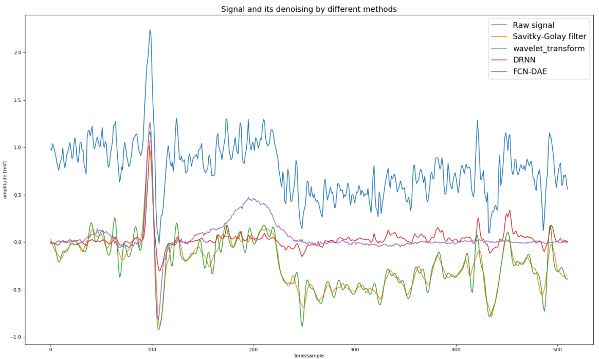

# ECG_denoising
Python command line application used to denoise ECG data using wavelet transform, Savitzky-Golay filter and deep neural network.

## Considered noises
<ul>
  <li>baseline wander</li>
  <li>power line interference</li>
  <li>external electromagnetic fields</li>
  <li>random body movements</li>
</ul>

## Wavelet transform
Steps:
<ol>
  <li>Signal loading</li>
  <li>Multilevel signal decomposition</li>
  <li>Signal denoising using SureShrink method</li>
  <li>Inverse Discrete Wavelet Transform</li>
</ol>

Summary: 
Mostly Daubechies and Symlets wavelets were tested. Best performance largly depends on signal, however sym10, sym11, sym13 and db13 are the best wavelets for used database. If it comes to decompostion level, best performance shows third decomposition level.

## Savitzky-Golay filter
Best performance can be observed for window length = 2, polynomial degree = 2 and padding method = "interp".

## Deep neural networks
Each network was trained using QT database and MIT-BIH Noise Stress Database.

### FCN-DAN
Autoencoder neural network, used to teach network how to encode and decode desired signal.
FCN-DAN results are much better than aforementioned methods, nevertheless network was learning on specific dataset.
 mean RMSE = 1.859
 mean MAD = 0.429 

### DRNN
Simple neural network consisted of LSTM layer and densely connected following layers (consisted of 64 neurons each).
 mean RMSE = 3.047
 mean MAD = 0.689

## Results Overview

## Databases
<ul>
  <li><a href="https://physionet.org/content/ecgiddb/1.0.0/">ECG-ID Database</a></li>
  <li><a href="https://physionet.org/content/qtdb/1.0.0/">QT Database</a></li>
  <li><a href="https://physionet.org/content/nstdb/1.0.0/">MIT-BIH Noise Stress Test Database</a></li>
</ul>

  
